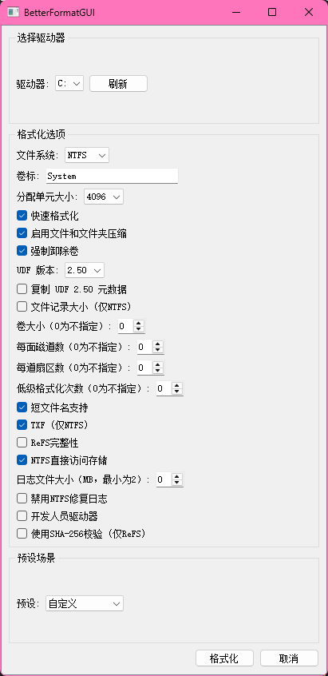

# BetterFormatGUI

# 更好的格式化图形用户界面

🎉 一款基于PyQt5开发的文本格式化工具，提供直观的图形界面操作



## 主要功能

- 📝 支持多种文本格式预设
- 🖥️ 可视化操作界面
- ⚡ 一键快速格式化
- 🎨 自定义样式配置

## 安装要求

- Python 3.8+
- Windows系统

## 快速开始

```bash
# 安装依赖
pip install -r requirements.txt

# 运行程序
python main.py
```

## 许可证

本项目采用 [MIT License](LICENSE)
